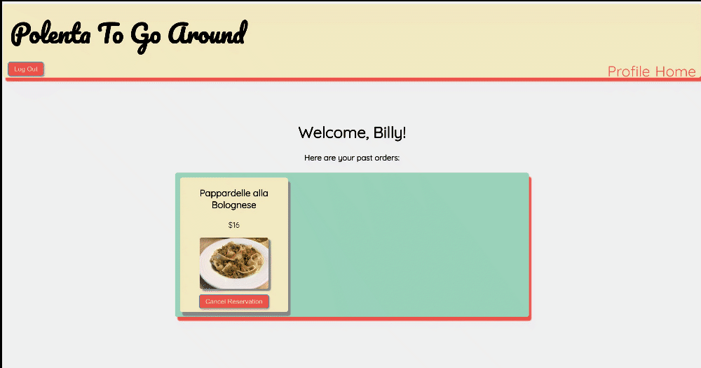

# Polenta to go Around

This is a demo for **Polenta to go Around**, a website designed to fight food waste by linking users with restaraunts seeking to sell discounted food that would otherwise be discarded. Built with React on the frontend and Ruby on Rails on the backend.

Requires [Polenta to go Around frontend](https://github.com/jmarthaller/food-waste-app-frontend) and [Polenta to go Around backend](https://github.com/svthiery/food-waste-app-backend).

Created in partnership with Flatiron School cohort-mate [Sarah Thierry](https://github.com/svthiery). 

## Features

### Login

Users can login to access their PtgA account. A user's login has validations. Upon a successful login attempt a user will be taken to the site's main landing page, which contains all of the available pickup opportunities. 

  
  

### Search/Filter

Users can search for a pickup opportunity based on the name of a dish.

  
  

Users can filter picup opportunities based on the cuisine of a pickup.

  
  

### Favorite

Users can favorite a restaurant, which will then get added to their favorite's container

  
  

### Reserve/Delete Pickup

Clicking the "Reserve Item" button will add the item to that user's list of pickups, and will direct the user to their personal profile page. 

  
  

Users are able to delete their pickup by clikcing the "Cancel Reservation" button

  
  

